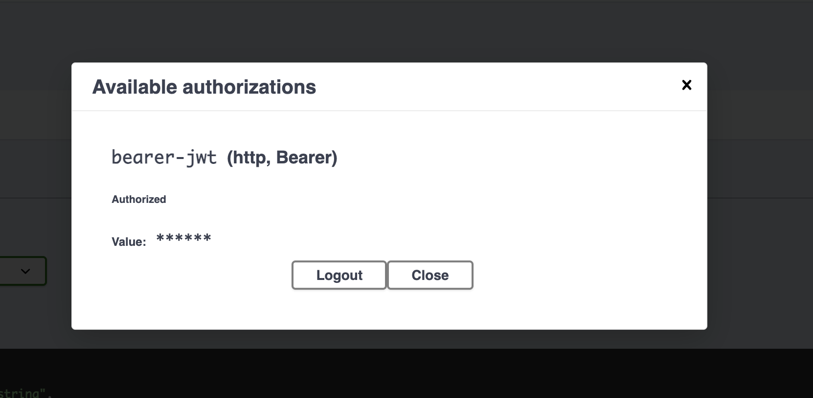
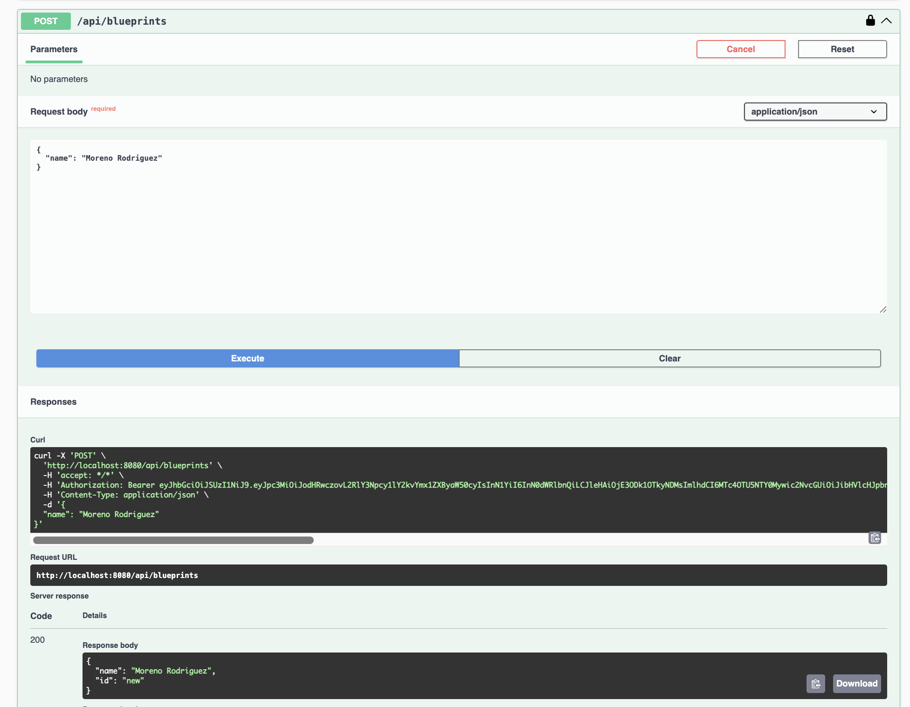

# 1: endpoints publicos y protegidos

## Como funciona la seguridad

La aplicacion revisa cada solicitud antes de permitir el acceso. Hay rutas que se pueden consultar sin iniciar sesion y otras que necesitan un token de acceso.

## Endpoints publicos

Estos endpoints no necesitan token:

| Endpoint | Para que sirve |
| --- | --- |
| `GET /actuator/health` | Permite comprobar si la aplicacion esta funcionando. |
| `POST /auth/login` | Recibe el usuario y la contrasena y entrega un token. |
| `GET /v3/api-docs/**` | Muestra la informacion de la API para Swagger. |
| `GET /swagger-ui/**` | Permite abrir la interfaz de Swagger. |
| `GET /swagger-ui.html` | Direccion alternativa para abrir Swagger. |

El login debe ser publico porque es el primer paso para obtener el token. Si tambien estuviera protegido, no habria una forma inicial de autenticarse.

Ejemplo de login:

```
POST http://localhost:8080/auth/login
Content-Type: application/json

{
	"username": "student",
	"password": "student123"
}
```


La respuesta incluye un `access_token`. Ese valor se envia en las siguientes solicitudes usando `Authorization: Bearer <token>`.

## Endpoints protegidos

Las rutas que empiezan por `/api/` necesitan un token valido y un permiso:

| Endpoint | Permiso | Resultado |
| --- | --- | --- |
| `GET /api/blueprints` | `blueprints.read` | Consulta la lista de blueprints. |
| `POST /api/blueprints` | `blueprints.write` | Crea un nuevo blueprint. |

Aunque la configuracion general permite el acceso a `/api/**` cuando el token tiene alguno de esos permisos, cada operacion tambien revisa su permiso en concreto. Por eso, un token que solo permita consultar no deberia usarse para crear blueprints.

Ejemplo para consultar:

```
GET http://localhost:8080/api/blueprints
Authorization: Bearer <token_generado>
```



Ejemplo para crear:

```
POST http://localhost:8080/api/blueprints
Authorization: Bearer <token_generado>
Content-Type: application/json

{
	"name": "Moreno Rodriguez"
}
```



## Otras rutas

Cualquier ruta que no este declarada como publica requiere autenticacion. Es decir, si se agrega un endpoint nuevo y no se configura como publico, la aplicacion pedira un token para acceder a el.
