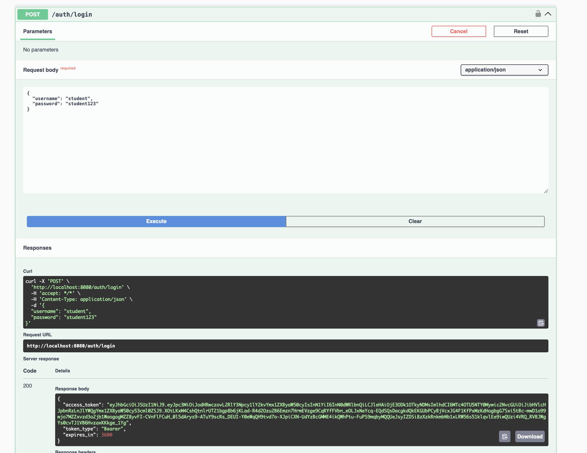

# 2: flujo de login y claims del JWT

El login es el primer paso para poder usar los endpoints protegidos. El usuario envia sus credenciales a `/auth/login`. Si son correctas, la aplicacion genera un token JWT y lo devuelve en la respuesta.

## Flujo del login

1. Se envia el nombre de usuario y la contraseña.
2. La aplicacion comprueba que el usuario exista y que la contrasena sea correcta.
3. Si los datos son validos, se crea el token.
4. El token se envia en el encabezado `Authorization` para consultar o crear blueprints.

Ejemplo:

```
POST http://localhost:8080/auth/login

{
	"username": "student",
	"password": "student123"
}
```

La respuesta tiene esta estructura generalmente:

```
{
	"access_token": "eyJhbGciOiJSUzI1NiIs...",
	"token_type": "Bearer",
	"expires_in": 3600
}
```



## Claims del token

Un JWT tiene informacion interna llamada *claims*. En este caso se nos generan los siguientes:

| Claim | Significado |
| --- | --- |
| `iss` | Indica quien emitio el token: `https://decsis-eci/blueprints`. |
| `iat` | Indica el momento en que se creo el token. |
| `exp` | Indica cuando deja de ser valido. Dura 3600 segundos, osea una hora. |
| `sub` | Indica el usuario que inicio sesion, por ejemplo `student`. |
| `scope` | Indica las acciones permitidas: `blueprints.read` y `blueprints.write`. |


## Como revisar las claims

Despues de ejecutar el login, copia el valor completo de `access_token` y pegalo en un lector de JWT, como [jwt.io](https://jwt.io/). El sitio mostrara el encabezado, las claims y la firma.

Las claims tendran una forma parecida a esta:

```
{
	"iss": "https://decsis-eci/blueprints",
	"iat": 1726483200,
	"exp": 1726486800,
	"sub": "student",
	"scope": "blueprints.read blueprints.write"
}
```


Los valores `iat` y `exp` cambian cada vez que se genera un token. El valor `sub` cambia si se inicia sesion con otro usuario valido. El `scope` permite que el servidor sepa si el usuario puede consultar o crear blueprints.

No es necesario modificar el token manualmente. Si se cambia su contenido, la firma deja de coincidir y la API lo rechazara.
